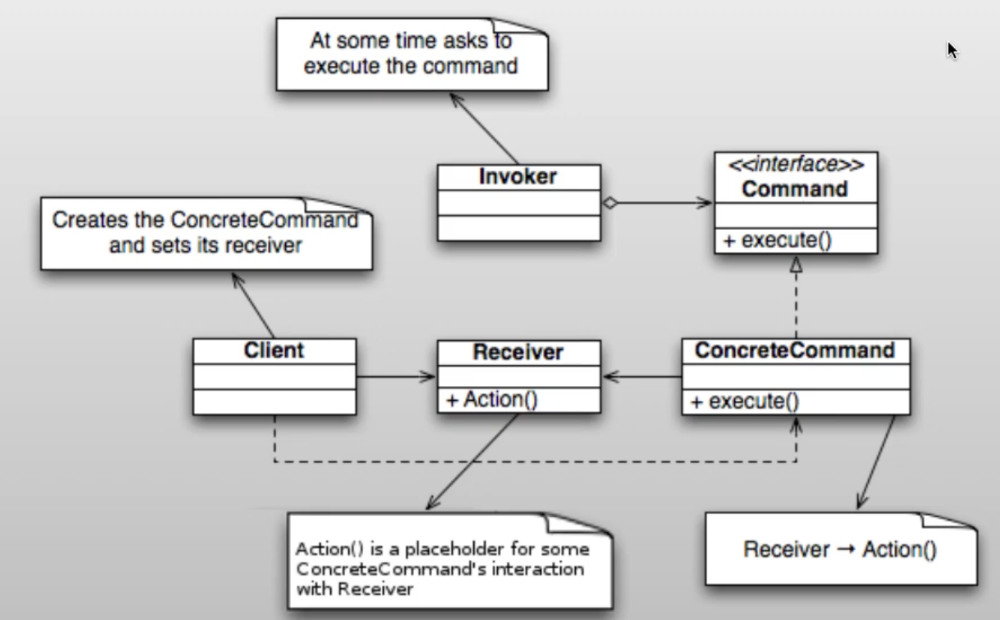

# Command pattern

## ¿Qué es el patrón?
Es un patrón de comportamiento que convierte una solicitud en un objeto independiente que contiene toda la información sobre dicha solicitud, permitiendo parametrizar métodos con diferentes solicitudes y aplazar su ejecución.

## ¿Qué nos permite hacer?
Nos permite encapsular operaciones como objetos, lo que posibilita almacenarlas, ponerlas en cola, registrarlas y deshacer o rehacer su ejecución de forma sencilla.

## ¿Para qué es útil el patrón?
Es útil para implementar operaciones deshacer/rehacer (undo/redo), colas de tareas, registro de operaciones (logging), transacciones, o cuando se necesita parametrizar objetos con acciones que se ejecutarán más tarde.

## Ventajas
- Desacopla al objeto que invoca la operación del objeto que sabe cómo ejecutarla.
- Las operaciones se pueden almacenar, encolar, registrar y revertir fácilmente.
- Facilita la implementación de undo/redo sin lógica compleja en el invocador.
- Permite componer comandos en macros o transacciones complejas.

## Desventajas
- Aumenta el número de clases, ya que cada operación requiere su propia clase comando.
- Puede ser excesivo para operaciones simples que no necesitan deshacer ni encolado.
- La gestión del historial de comandos puede consumir memoria si hay muchas operaciones.

## Casos de uso en vida real
- **Editores de texto**: Ctrl+Z / Ctrl+Y en Word, VS Code o Google Docs implementan undo/redo con Command.
- **Interfaces gráficas**: Botones y menús encapsulan sus acciones como comandos independientes del widget.
- **Colas de tareas**: Sistemas de jobs como Celery o RabbitMQ envían comandos serializados para ejecución diferida.
- **Transacciones de base de datos**: Cada operación SQL se encapsula como un comando que puede confirmarse o revertirse.
