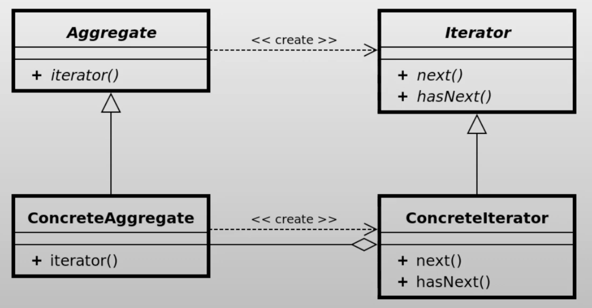

# Iterator pattern

## ¿Qué es el patrón?
Es un patrón de comportamiento que proporciona una forma de recorrer secuencialmente los elementos de una colección sin exponer su representación interna (lista, árbol, grafo, etc.).

## ¿Qué nos permite hacer?
Nos permite acceder a los elementos de una colección uno a uno de forma uniforme, independientemente del tipo de estructura de datos que la almacena internamente.

## ¿Para qué es útil el patrón?
Es útil cuando se necesita una forma estándar de recorrer distintos tipos de colecciones, cuando se quiere ocultar la complejidad interna de la estructura de datos al cliente, o cuando se requieren múltiples formas de recorrer la misma colección (por ejemplo, en orden directo o inverso).

## Ventajas
- Proporciona una interfaz uniforme para recorrer cualquier tipo de colección.
- Oculta la representación interna de la colección al código cliente.
- Permite tener múltiples iteradores activos simultáneamente sobre la misma colección.
- Facilita la aplicación del principio de responsabilidad única separando el algoritmo de recorrido de la colección.

## Desventajas
- Puede ser innecesariamente complejo para colecciones simples donde un bucle for sería suficiente.
- Algunos iteradores especializados (por ejemplo, en árboles) pueden ser menos eficientes que el recorrido nativo.
- Modificar la colección mientras se itera puede causar errores difíciles de detectar.

## Casos de uso en vida real
- **Java Collections Framework**: `Iterator` e `Iterable` son la base del bucle for-each en listas, conjuntos y mapas.
- **Cursores de base de datos**: JDBC usa un `ResultSet` como iterador sobre las filas devueltas por una consulta SQL.
- **Streams de datos**: Los streams de Java 8 y los generadores de Python implementan iteración perezosa sobre secuencias potencialmente infinitas.
- **Sistemas de archivos**: Recorrido de directorios y subdirectorios de forma uniforme independientemente del sistema operativo.
