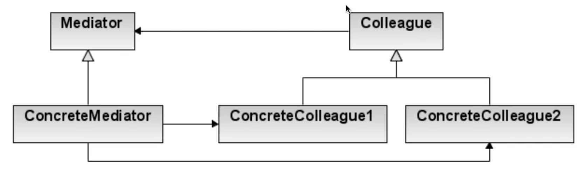

# Mediator pattern

## ¿Qué es el patrón?
Es un patrón de comportamiento que define un objeto mediador que encapsula la forma en que interactúan un conjunto de objetos, promoviendo el bajo acoplamiento al evitar que los objetos se refieran entre sí directamente.

## ¿Qué nos permite hacer?
Nos permite centralizar la lógica de comunicación compleja entre múltiples objetos en un único mediador, de modo que cada objeto solo conoce al mediador y no a los demás participantes.

## ¿Para qué es útil el patrón?
Es útil cuando la lógica de comunicación entre muchos objetos se vuelve tan compleja que resulta difícil de mantener, como en componentes de UI que se actualizan mutuamente, sistemas de chat, o controladores de tráfico aéreo donde múltiples entidades deben coordinarse.

## Ventajas
- Reduce el acoplamiento entre componentes al eliminar las referencias directas entre ellos.
- Centraliza la lógica de coordinación en un solo lugar, facilitando su comprensión y mantenimiento.
- Facilita la reutilización de los componentes en otros contextos al hacerlos independientes entre sí.
- Simplifica la comunicación en sistemas con muchos participantes que interactúan entre sí.

## Desventajas
- El mediador puede convertirse en un "God Object" que acumula demasiada lógica y responsabilidades.
- Es un punto único de fallo: si el mediador falla, toda la comunicación del sistema se ve afectada.
- Puede ser difícil de mantener si las reglas de interacción entre componentes son muy complejas.

## Casos de uso en vida real
- **Salas de chat**: Un servidor de chat actúa como mediador entre todos los usuarios conectados, retransmitiendo mensajes sin que los usuarios se conozcan entre sí.
- **Controlador de tráfico aéreo**: La torre de control coordina los despegues y aterrizajes sin que los aviones se comuniquen directamente entre ellos.
- **Formularios complejos de UI**: Un mediador sincroniza el estado de múltiples campos (combos, checkboxes, inputs) que se habilitan o deshabilitan mutuamente.
- **Event Bus en arquitecturas frontend**: Redux o MobX actúan como mediadores entre componentes de React que necesitan compartir estado.
