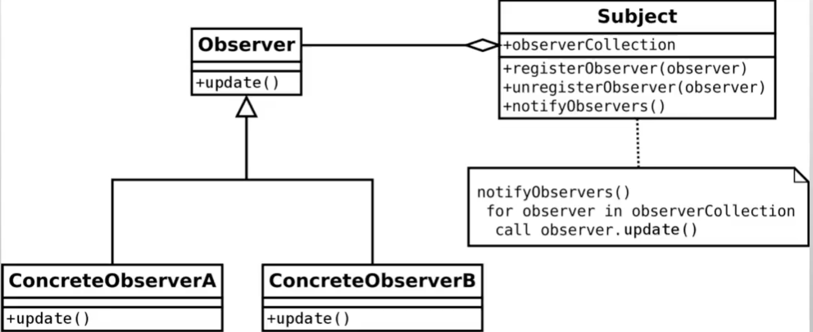

# Observer pattern

## ¿Qué es el patrón?
Es un patrón de comportamiento que define una dependencia de uno a muchos entre objetos, de modo que cuando un objeto (sujeto) cambia de estado, todos sus dependientes (observadores) son notificados y actualizados automáticamente.

## ¿Qué nos permite hacer?
Nos permite implementar un mecanismo de suscripción/notificación donde los objetos pueden suscribirse para recibir eventos de otro objeto sin que haya un acoplamiento fuerte entre ellos.

## ¿Para qué es útil el patrón?
Es útil en sistemas basados en eventos, interfaces de usuario reactivas, arquitecturas publisher/subscriber, propagación de cambios de modelo a vistas (como en MVC), o cualquier situación donde múltiples objetos deban reaccionar al cambio de estado de otro.

## Ventajas
- Bajo acoplamiento entre el sujeto y sus observadores: el sujeto no conoce los detalles de los observadores.
- Permite agregar o eliminar observadores en tiempo de ejecución de forma dinámica.
- Soporta comunicación broadcast de uno a muchos sin esfuerzo adicional.
- Promueve el principio abierto/cerrado: se pueden añadir nuevos observadores sin modificar el sujeto.

## Desventajas
- El orden en que se notifica a los observadores no siempre está garantizado.
- Puede provocar memory leaks si los observadores no se desregistran correctamente.
- Con muchos observadores o notificaciones en cascada, el rendimiento puede degradarse.
- Las actualizaciones inesperadas pueden ser difíciles de rastrear cuando hay muchos suscriptores.

## Casos de uso en vida real
- **Frameworks reactivos**: React, Vue y Angular notifican a los componentes cuando el estado cambia para re-renderizarlos.
- **Sistemas de notificaciones push**: Apps como Instagram o WhatsApp notifican a los seguidores cuando hay nuevo contenido.
- **Bolsa de valores**: Múltiples pantallas y sistemas reciben actualizaciones en tiempo real cuando cambia el precio de un activo.
- **Patrón MVC**: El Modelo notifica a las Vistas cuando sus datos cambian, sin conocer los detalles de cada vista.
