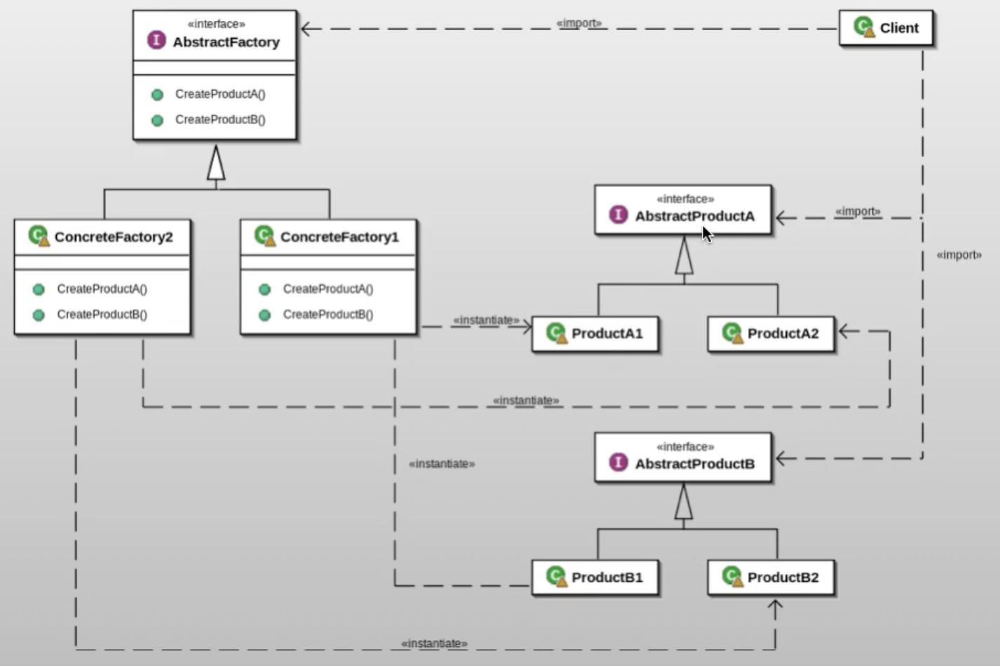

# Abstract Factory pattern

## ¿Qué es el patrón?
Es un patrón creacional que proporciona una interfaz para crear familias de objetos relacionados o dependientes entre sí, sin especificar sus clases concretas.

## ¿Qué nos permite hacer?
Nos permite crear grupos de objetos relacionados (familias) garantizando que sean compatibles entre sí. El cliente trabaja con las fábricas y productos a través de interfaces abstractas, sin depender de implementaciones concretas.

## ¿Para qué es útil el patrón?
Es útil cuando el sistema debe ser independiente de cómo se crean, componen y representan sus productos, y cuando se necesita trabajar con varias familias de productos (por ejemplo, distintos temas de UI o distintos proveedores de base de datos) de forma intercambiable.

## Ventajas
- Garantiza la compatibilidad entre los productos de una misma familia, evitando combinaciones incorrectas.
- Aísla el código concreto de creación del resto de la aplicación, facilitando el cambio de familia completa.
- Promueve la consistencia entre productos relacionados al forzar su uso conjunto.
- Facilita el intercambio de familias completas de productos con un único cambio de fábrica.

## Desventajas
- Agregar nuevos tipos de productos a la familia requiere modificar la interfaz de la fábrica y todas sus implementaciones.
- Puede generar un gran número de interfaces y clases, aumentando la complejidad del sistema.
- La estructura inicial puede ser difícil de diseñar correctamente si la familia de productos no está bien definida.

## Casos de uso en vida real
- **Temas de interfaz gráfica**: Una aplicación soporta temas claro y oscuro; la fábrica produce botones, checkboxes y menús coherentes con el tema seleccionado.
- **Drivers de base de datos**: Un sistema puede trabajar con MySQL, PostgreSQL o SQLite cambiando la fábrica que crea las conexiones, comandos y transacciones.
- **Kits de UI multiplataforma**: Frameworks como Qt o JavaFX crean componentes nativos distintos según el sistema operativo (Windows, macOS, Linux) usando una fábrica por plataforma.
- **Proveedores de servicios cloud**: Una aplicación puede usar AWS, Azure o GCP como proveedores de almacenamiento y cómputo intercambiando la fábrica de servicios cloud.
