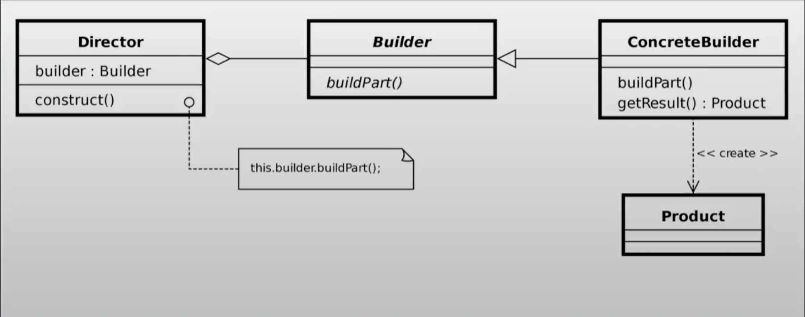

# Builder pattern

## ¿Qué es el patrón?
Es un patrón creacional que separa la construcción de un objeto complejo de su representación, permitiendo que el mismo proceso de construcción pueda crear diferentes representaciones del objeto.

## ¿Qué nos permite hacer?
Nos permite construir objetos complejos paso a paso. Podemos producir distintos tipos y representaciones de un objeto usando el mismo código de construcción, evitando constructores con muchos parámetros.

## ¿Para qué es útil el patrón?
Es útil cuando la creación de un objeto requiere muchos pasos o configuraciones opcionales, y cuando se quiere evitar el "telescoping constructor" (constructores con múltiples parámetros). También es útil cuando se necesita construir distintas variantes del mismo tipo de objeto.

## Ventajas
- Permite construir objetos complejos paso a paso, con solo los parámetros necesarios.
- Elimina el "telescoping constructor": no hay constructores con decenas de parámetros opcionales.
- El mismo proceso de construcción puede producir representaciones distintas del objeto.
- Facilita la creación de objetos inmutables con muchos atributos configurables.

## Desventajas
- Añade verbosidad y más clases al código respecto a simplemente usar un constructor.
- Si el objeto a construir es simple, el patrón resulta innecesariamente complejo.
- El Builder y el objeto que construye deben mantenerse sincronizados si el objeto cambia.

## Casos de uso en vida real
- **Construcción de queries SQL**: Librerías como QueryDSL o Hibernate Criteria API usan un Builder para construir consultas complejas de forma legible y segura.
- **Clientes HTTP**: `OkHttpClient.Builder` o `HttpRequest.newBuilder()` de Java permiten configurar headers, timeouts y cuerpo del request paso a paso.
- **Documentos y reportes**: Librerías como iText o Apache POI usan builders para construir PDFs o documentos Excel con secciones opcionales.
- **Configuración de objetos complejos**: `AlertDialog.Builder` en Android permite construir diálogos configurando título, mensaje, botones y listeners de forma opcional.
