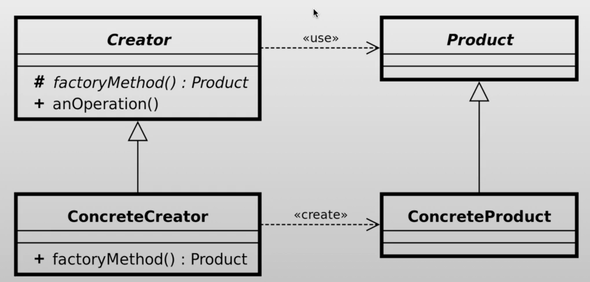

# Factory method pattern

## ¿Qué es el patrón?
Es un patrón creacional que define una interfaz para crear un objeto, pero deja que las subclases decidan qué clase concreta instanciar. En lugar de llamar directamente al constructor, se delega la creación a un método fábrica que puede ser sobreescrito.

## ¿Qué nos permite hacer?
Nos permite crear objetos sin acoplar el código al tipo concreto del objeto creado. Las subclases pueden cambiar el tipo de objeto que se produce simplemente sobreescribiendo el método fábrica.

## ¿Para qué es útil el patrón?
Es útil cuando no se conoce de antemano el tipo exacto del objeto a crear, cuando se quiere que las subclases controlen la creación de objetos, o cuando se desea reutilizar objetos existentes en lugar de crearlos siempre desde cero.

## Ventajas
- Evita el acoplamiento entre el código creador y las clases concretas de los productos.
- Centraliza la lógica de creación en un solo lugar, facilitando el mantenimiento.
- Las subclases pueden sobreescribir el método fábrica para cambiar el tipo de objeto producido (principio abierto/cerrado).
- Facilita la introducción de nuevos tipos de productos sin romper el código existente.

## Desventajas
- Puede requerir la creación de muchas subclases si hay muchos tipos de productos.
- Introduce una capa adicional de abstracción que puede ser difícil de seguir en proyectos pequeños.
- Si el método fábrica es el único punto de variación, puede resultar sobrediseño frente a simplemente usar un constructor.

## Casos de uso en vida real
- **Loggers**: Frameworks como SLF4J usan un Factory Method (`LoggerFactory.getLogger()`) para obtener un logger concreto según la implementación configurada.
- **Conexiones a bases de datos**: `DriverManager.getConnection()` de JDBC decide qué driver concreto instanciar según la URL de conexión proporcionada.
- **Serialización de objetos**: Jackson o Gson usan factories para crear deserializadores concretos según el tipo de dato a procesar.
- **Creación de elementos UI en frameworks**: Frameworks como Angular crean componentes dinámicamente usando ComponentFactory sin conocer el tipo concreto en tiempo de compilación.
