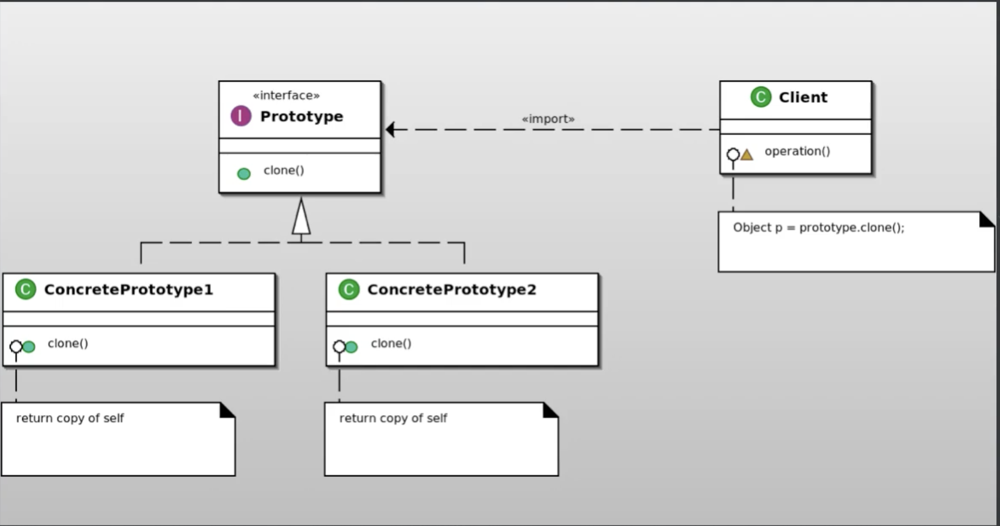

# Prototype pattern

## ¿Qué es el patrón?
Es un patrón creacional que permite copiar objetos existentes sin que el código dependa de sus clases concretas. El propio objeto es responsable de clonarse a sí mismo.

## ¿Qué nos permite hacer?
Nos permite duplicar objetos complejos sin conocer sus detalles internos ni depender de su clase concreta. Basta con llamar al método de clonación del objeto original para obtener una copia exacta.

## ¿Para qué es útil el patrón?
Es útil cuando la creación de un objeto desde cero es costosa o compleja, y resulta más eficiente clonar una instancia ya configurada. También es útil para reducir el número de subclases cuando la única diferencia entre ellas es el estado inicial del objeto.

## Ventajas
- Clonar un objeto es más eficiente que crear uno nuevo desde cero cuando la inicialización es costosa.
- Reduce la dependencia del código cliente de las clases concretas de los objetos que crea.
- Permite agregar y eliminar productos en tiempo de ejecución registrando nuevos prototipos.
- Simplifica la creación de objetos complejos que requieren una configuración inicial elaborada.

## Desventajas
- Implementar la clonación puede ser complejo cuando el objeto tiene referencias circulares o dependencias profundas.
- La diferencia entre copia superficial (shallow copy) y copia profunda (deep copy) puede causar errores difíciles de detectar.
- Requiere que todos los objetos de la jerarquía implementen la interfaz de clonación, lo que puede ser invasivo.

## Casos de uso en vida real
- **Editores gráficos**: Copiar y pegar formas, capas o elementos en Figma, Photoshop o Illustrator clona el objeto seleccionado con todos sus atributos.
- **Configuraciones predefinidas de objetos**: Un videojuego define prototipos de enemigos con estadísticas base y los clona para crear instancias en el mapa con variaciones mínimas.
- **Caché de objetos costosos**: Sistemas que crean objetos complejos (como conexiones configuradas o documentos parseados) los cachean como prototipos y los clonan cuando se necesitan.
- **Clonación de documentos**: Aplicaciones de ofimática como Google Docs permiten crear un documento nuevo a partir de una plantilla existente, clonando su estructura y formato.
