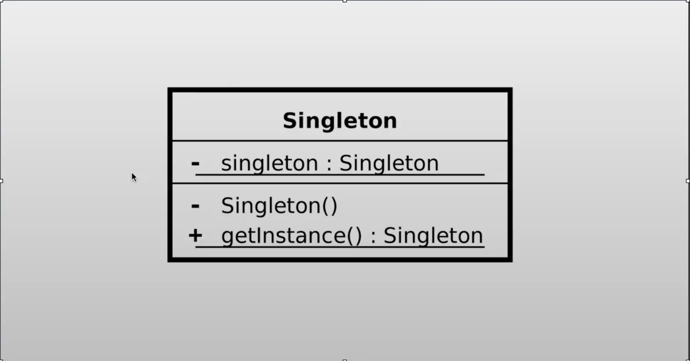

# Singleton pattern

## ¿Qué es el patrón?
Es un patrón creacional que garantiza que una clase tenga una única instancia en toda la aplicación y proporciona un punto de acceso global a dicha instancia.

## ¿Qué nos permite hacer?
Nos permite controlar el acceso a recursos compartidos (como una conexión a base de datos o un archivo de configuración) asegurando que solo exista un único objeto de ese tipo en todo el sistema.

## ¿Para qué es útil el patrón?
Es útil cuando se necesita exactamente una instancia de una clase que coordine acciones a lo largo del sistema, como gestores de configuración, pools de conexiones, registros de logs o cachés compartidas.

## Ventajas
- Garantiza que solo exista una instancia del objeto en todo el sistema, evitando inconsistencias.
- Proporciona un punto de acceso global al recurso compartido sin necesidad de pasarlo como parámetro.
- La instancia se crea solo cuando se necesita por primera vez (lazy initialization), ahorrando recursos.
- Controla el acceso concurrente a recursos compartidos cuando se implementa correctamente con thread safety.

## Desventajas
- Dificulta las pruebas unitarias al introducir estado global que persiste entre tests.
- Viola el principio de responsabilidad única al gestionar tanto su propia creación como su lógica de negocio.
- Crea acoplamiento global: cualquier clase puede acceder al Singleton sin que sea explícito en su interfaz.
- En entornos multihilo, la implementación incorrecta puede causar condiciones de carrera.

## Casos de uso en vida real
- **Gestores de configuración**: Spring `ApplicationContext` o archivos de configuración de una app se cargan una vez y se acceden globalmente.
- **Pool de conexiones a base de datos**: HikariCP o c3p0 gestionan un pool único de conexiones compartido por toda la aplicación.
- **Sistemas de logging**: Log4j o SLF4J usan un logger singleton para centralizar la escritura de logs desde cualquier parte del sistema.
- **Caché en memoria**: Implementaciones de caché como un mapa compartido de sesiones de usuario que debe ser único en toda la aplicación.
